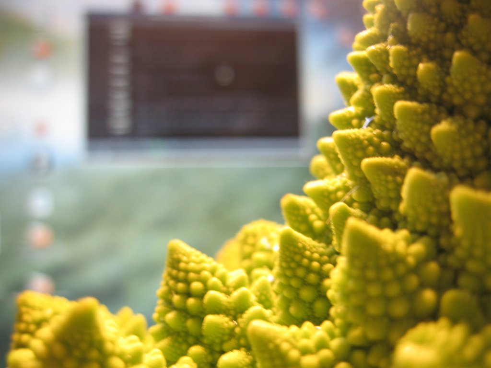

Found this vegetable on the net by accident a year ago or so and have been meaning to buy one ever since. As of today I am a satisfied owner of a [Broccoli Romanesco][1] and here are my first explorations of this crazy lump of organic matter:

After a while I realized that it wouldn't last forever, no matter how much I wanted it, so I probably had to eat it in a near future. If anyone has good recipes containing this vegetable, please let me know. My first ride on the google spaceship brought me [here][2].

[1]: https://en.wikipedia.org/wiki/Romanesco_broccoli
[2]: https://web.archive.org/web/20071027135149/http://www.gapersblock.com/airbags/archives/alien_fractals_or_broccolis_cousin/
