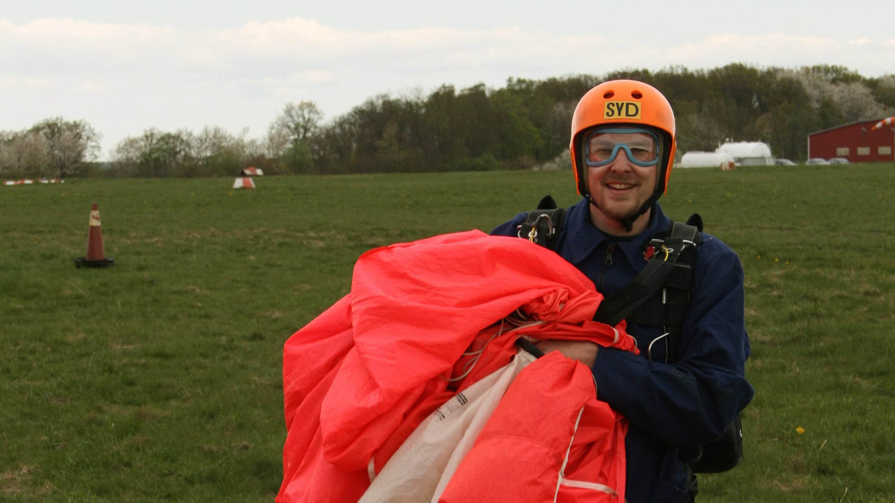

So, I've finally tried my wings, or at least the carrying capacity of the parachute.

The training I took part of was a couple of sessions of theory, some jumping
off a ladder, muscle memory of pulling the secondary parachute if the first one
failed, folding a parachute under supervision, working my way up to the
day of the jump, which was going to be in solitude - with nobody else to depend
on getting me safely back on ground other than my own knowledge and senses.

We entered the old _USSR_ propeller plane in Eslöv, long benches on each side along the
hull, face to face with the other rookies, squeezed tight. Too noisy to speak so when
reaching the target altitude of about 1500 meters the jump leader pointed at person
after person to jump. Before I knew it, the finger was pointing straight in my face.

With a cord connecting the sprint of the parachute to the airplane I found myself
standing at the edge of the hatch, holding the handles, wind blowing hard in my face,
looking down at the ground where I'd been standing just moments ago. It felt surreal
to say the least.

Cliché thoughts like _"This is not normal, what the hell am I doing?"_ passed through
my head, countered by reasoning that the test leader wouldn't allow me to be in this
position if there was a high probability that I would die.

_As I felt a clap on my back, I took the leap._

It's a very non-intuitive thing to do. A couple of million years ago our ancestors
climbed down the trees, and the vast majority of us have remained fairly close to
ground ever since. The most rational reason to leave an airplane in this manner would
be if it was going to crash, explode or some other horrible outcome. Yet here I was,
leaning 45 degrees out of a perfectly functioning airplane, hands in the middle of the
air - grasping the nothingness, feet barely touching the closest thing to safety for
just a fraction of a second longer.

What happened next is both easy and hard to explain.  The sprint of the backpack was
attached to the airplane via a short cord. The length of the cords connecting the harness
to the parachute cloth is about 10 meters, which, given gravity and the length of the
auto-deploy cord, results in a bit over a second long free fall, and then over to gliding
under the parachute.

My recollection is a bit more nuanced. Once my feet had lost contact with the airplane
my perception of sensory input radically changed. It felt as if reality grabbed hold
of my face, violently forcing itself into my experience at an extreme pace. My field
of vision felt widened as I looked out onto the horizon and the Scanian landscape.
From the depths of my throat, an abysmal scream of terrified excitement rushed out -
yet I recall an [absolute silence][1]. I wouldn't say time stood still as that would
exclude the passage of events, but it was without doubt [largest time dilation][2] I
had ever perceived. Just as quickly as I had entered this frame of mind, just as quickly
I was jolted right back out of it, finding myself hanging safely under the parachute,
slowly swinging from one side to the other.

The glide down was probably impressive as well, but for me it got somewhat lost 
in the shadows of what I had just experienced and it's not something that I look
back to with the same warm feelings as the initial leap. I managed to navigate to
the correct landing spot, but it proved difficult to get the forward movement down
to a reasonable speed and at the same time matching the downward movement towards
the ground. It was a rough landig, but I did so without injury and could enjoy
what was left from the afterglow of this extreme experience before the last of it
had faded.

There's nothing quite like it. Rollercoasters don't stand a chance. Personally
I have no wish to try it again - the risk of injury during landing seem a bit too
plausible. If it was just the jumping out the airplane over and over again I'd be
first in line. Based on this, I think my next experience in this category will be
a bungee jump, or perhaps a tandem parachute jump which would increase the free
fall to 45 seconds.

[1]: https://en.wikipedia.org/wiki/Auditory_exclusion
[2]: https://en.wikipedia.org/wiki/Tachypsychia