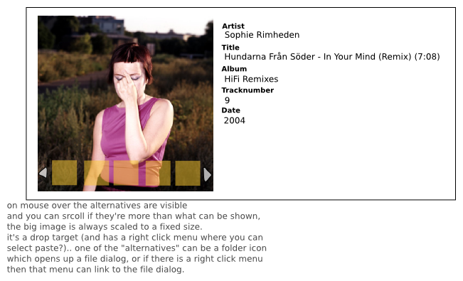

In the world of XMMS2 there are a heap of clients that more or less rip the design from something that already exists. Some clients have potential, while a lot of clients are just _"Hey, I has writes my 0wnz0r music player!! zomgbbqzuhl!!11!"_. Though this kind of sucks when new users find XMMS2 and have to wade through an ocean of crap, it also reflects how easy it is to whip up a GUI connected to a real application so that you can try out new concepts in a live environment without much hassle, which is a good thing™.

I myself am far from a GUI designer, but every once in a while I come up with some idea that I actually decide to implement. The downside is that I've never as of yet put my ideas together into a whole client but instead they end up in my `~/dev_home` directory and bitrot, so here comes two ideas that I haven't seen anyone experiment with, that with some luck might get picked up by some client author.

**First out**, an attractive info dialog.

Basically looks like the standard old info dialog that we have seen before, but with the coverart switcher added. The idea is that when you drag your mouse over the image you get a number of alternative images. We have the `xmms2-covers` client that surfs the net for coverart and then adds them to the entries in the media library, it's pretty common that some art is found at multiple places in a variety of qualities, and the user should easily be able to pick one of them, or optionally pick one from file.

So some weeks back I wrote two implementations of this kind of view.

Clutter version:
`video: https://youtu.be/gJ0RGi9xUJE`

GTK version:
`video: https://youtu.be/u3Y5BMVsekc`

It's not a feature that propells your client to the moon with, but imho also the tiny parts should get their fair share of time and thought to give a rich user experience (without offending the user with too much bling ofc).

**Second out**, Sliding GUI.

The idea was to have a simple GUI that only showed information to the user relevant to the current use case. This was accomplished by having a small number of cards (3 in my example) that slide, like the desktop switch effects on Mac OS X and Compiz. The first card was to show coverart in 90% of the screen and then artist - title (and maybe album), the second card held the playlist, and the third card was undefined. By pressing tab the next card slides in, and when reaching the last card, a final slide occurs passing all cards until the first card is visible. Later I realized that this is kind of how the iPod works, evil Apple manipulating my brain! :wink:

Anyway, here's a screencast.

`video: https://youtu.be/icLdT_WmT5c`

This idea could actually be implemented for Esperanza. There would be two cards then, one for coverart/artist/title (card A), and one for the playlist (card B). When moving focus and/or mouse out from Esperanza card A would be shown, and when focused/entered card B would be shown. Alternatively card B could be shown on focus/enter, and after a timeout card A could be shown.

**Conclusion (IANAGD)**

I think it's more important to question the reason for each part of the GUI, than to have a gazillion features, and it would probably not be a bad idea if the GTK client writers unite, and some goes for the QT client writers. Also, with the exception of Euphoria, no clients as of yet take advantage of animated GUI components. It's very easy to add animations here and there without making the GUI unusable, and it can add to the user experience, so why not take advantage of it? Oh, and I also want to see more web-awareness folks!

There, I've said it, time to hit the sofa and wait for the perfect client™ :wink:

(Oh, and the code for the above hacks exists, ask me on IRC if you really want to see, mostly really really ...._zzz_.... really nasty hacks).
