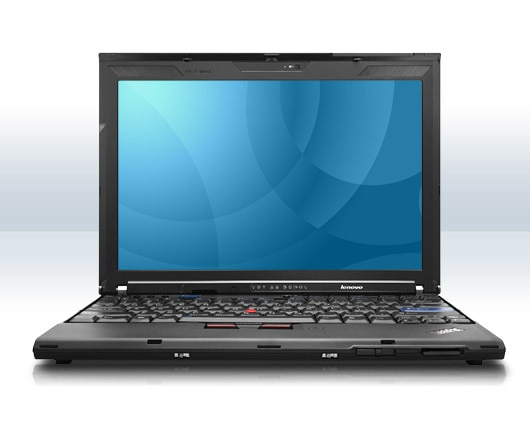

Got a new laptop at work yesterday, the long awaited ThinkPad X200.

Hands down best laptop ever. Everyone should throw away their old crappy laptops and get this one, or the X200s. I've started writing a page over at [ThinkWiki on how to install Debian on it][1].

[1]: https://web.archive.org/web/20081008033251/http://www.thinkwiki.org/wiki/Installing_Debian_on_an_X200 "Installing Debian on an X200"