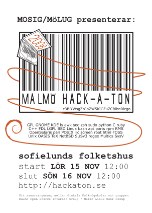

It's time again for the annual Hackaton where a heap of creative people meat up and bash their heads against their keyboards until something cool comes out. Be there, write the code, spread the source...

[][1]

Details can be found at the official page [here][2].

**Update**: Follow-up post on the event is found [here][3].

[1]: https://web.archive.org/web/20090419152709/http://www.friit.se/index.php?option=com_content&view=article&id=49:slaepp-programvaran-fri-det-aer-var&catid=2:nyheter&Itemid=2
[2]: https://web.archive.org/web/20081018210615/http://hackaton.se/wiki/index.php/Hack-A-Ton_2008
[3]: https://web.archive.org/web/20090419152718/http://www.friit.se/index.php?option=com_content&view=article&id=51:open-source-entusiaster-moettes-pa-garaget&catid=2:nyheter&Itemid=2