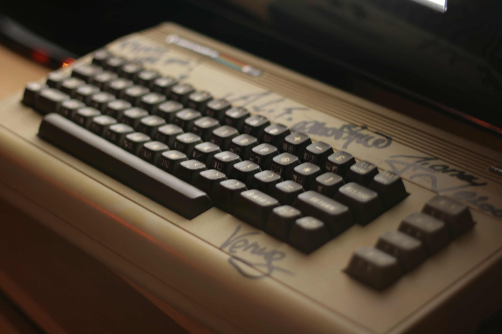

Two weeks ago it happened again. The annual synth music festival in Malmö, electricXmas. The evening started with some boozing up at the office with a crowd of 10 persons or so, lots of nice music and chattering before we hit the club. This years lineup was pretty nice: [Biomekkanik][4], [Autodafeh][5], Agonize, [Interlace][2] and [Welle:Erdball][3]. I wasn't really interested in anything other than Interlace and Welle:Erdball, but these two artists had each really great sets.

Also.. Welle:Erdball also threw out their instrument of choice into my drunk arms:

Unfortunately it doesn't seem to work properly after that crazy night, or I've failed to tune in the TV correctly (although I can easily find my other C64 on this TV). Next up is probably to switch over my other C64 into this new and signed chassi and get it to actually play some Welle:Erdball sids. Pretty nice to have a dedicated Welle:Erdball-computer :smile:

Right, and I at least requested vinyl versions of all of Interlace's albums, the answer was that it was interesting, and that it might happen. Enough for me to keep on hoping.

**Update**: I just ordered a [1541 Ultimate][1] so in a not too far future there will be Welle:Erdball playing on the real shit!

[1]: http://en.wikipedia.org/wiki/1541ultimate
[2]: https://musicbrainz.org/artist/6f55e532-3047-42ff-9352-677c496357fc
[3]: https://musicbrainz.org/artist/67d6773b-f927-493a-ae48-b5ad7c522291
[4]: https://musicbrainz.org/artist/205dec54-4071-48b8-8e10-ae9e3bfe3171
[5]: https://musicbrainz.org/artist/0d9ef6eb-574e-43e1-bcda-dd235e410305