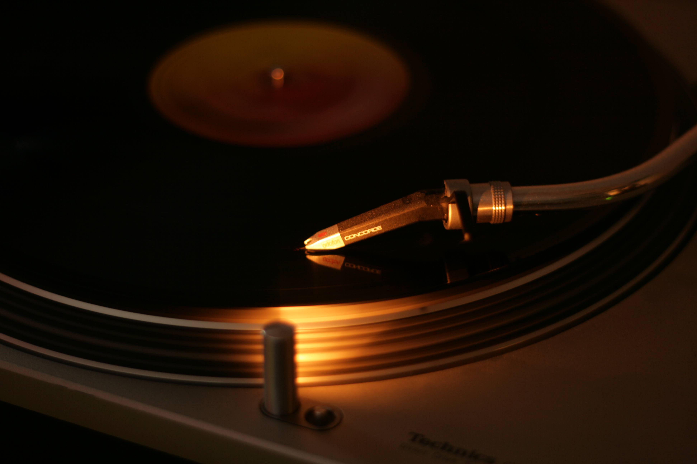

It was some time between Christmas and New Years last year I carried my [Technics SL-1200MK2][1] home in my arms. Now a year later I can say that it's hands down one of my best investments ever, I mean.. just look at it..

The first 6 months it wasn't used more than perhaps once a week, but when moving to my new apartment it was the easiest source of music for a long time due to the chaos of living in boxes. When order finally returned the habit was already there. I've listened to almost no digital source of music for the past 6 months when being at home, and my collection is close to filling my first box. When spending most of my awake time in front of a computer it feels very relaxing to kick back in the sofa to a really great analog music experience.

Here's the list of my current albums, with albums I've listened to the most marked as bold:

- Metallica
    - **Ride the Lightning**
    - ...and Justice for All
    - Kill 'em All
    - Master of Puppets
- The Beatles
    - **Abbey Read**
    - White Album
    - Sgt Pepper
    - Magical Mystery Tour
- Peps Persson
    - **Rotrock**
    - Persson sjonger Persson
- Bob Marley
    - **Kaya**
    - **Uprising**
- Jimi Hendrix
    - **Band of Gypsys**
    - **Electric Ladyland**
- Jim Morrison
    - **An American Prayer**
- The Doors
    - **The Soft Parade**
    - **Absolutely Live**
    - Waiting for the Sun
    - LA Woman
- Glen Miller
    - Story
    - A Memorial 1944-1969
- U2
    - Under the Joshua Tree
- Nirvana
    - **Nevermind**
- Mikael Wiehe
    - Kråksånger
- The Human League
    - Reproduction
- Plasticman
    - Sheet One
    - Closer
    - Musik
- Black Sabbath
    - **Black Sabbath**
    - Sabbath Bloody Sabbath
    - Paranoid
- Pink Floyd
    - The Wall
    - Dark Side of the Moon
    - Atom Heart Mother
    - Wish You Were Here
    - **A Saucerful of Secrets**
    - Animals
- Front 242
    - Tyrrany For You
- Kraftwerk
    - **Autobahn**
    - The Man Machine
    - Radio-Activity
- Bo Hansson
    - Ur Trollkarlens Hatt
    - **Sagan om Ringen**
    - El-Ahrairah
    - Mellanväsen
- The Stooges
    - **No Fun**

If you're thinking about getting a vinyl player but haven't made the final decision yet, then doit! You will not regret it.

[1]: https://en.wikipedia.org/wiki/Technics_SL-1200