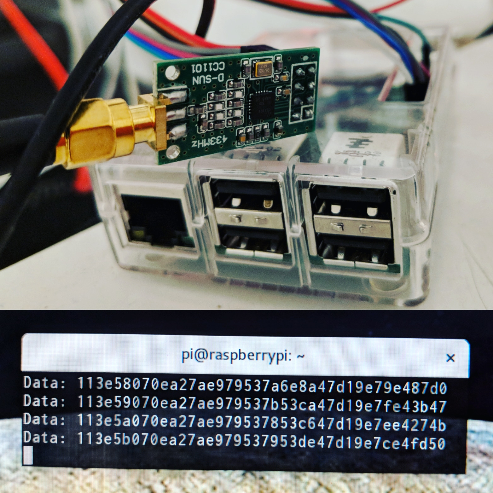

A couple of months ago I moved to a house, and the need to _monitor-all-the-things_ guided me towards the affordable IKEA Sparsnäs energy display. Sparsnäs is composed up of two parts, one being the transmitter that is attached to your electricity meter, and the other; the display that stores usage, and presents a variety of graphs. The downside is that there is no way of getting the data out of the display so you have to accept how it's presented, and that it may get lost, or build something on your own. Thankfully the protocol has been thoroughly reverse engineered and [documented][1] in a very elaborate manner. From a birds eye perspective it works by tracking how many LED blinks (per _n_ kW) that have occurred, and periodically transmits that count over radio, which the display then receives and presents.

In a previous experiment I learned the basics of decoding radio signals using [RTL-SDR][2] and [RfCat][3] which made it easy to follow along with the techniques described in the very detailed reverse engineering document. I did, however, not want to tie up any of those two hardware components to measure my power use as they're general purpose tools that I might want to use for other experiments in the future. Coincidentally, while it was still unsustainably cheap to put small orders on AliExpress I had among other electronics hoarded a $3 Texas Instruments `CC1101` radio module. After some months on the shelf this seemed like it could be its time to shine.

I had no idea how to make the Ti `CC1101` work as my embedded development experience is next to none, so I started off with first getting the signal decoded using the crude but functional RTL-SDR together with the open source application [sparsnas_decoder][4]. Here I learned how to generate the key, based on the device serial number, needed to decode the packet, and was able to get my first readings. This software however does the whole radio signal processing on its own, which is something I lack the knowledge to fully grasp, and thus don't want to maintain. I then moved on to the RfCat example script from the reverse engineering repository, equipped with the encryption key, and started changing things to see how it behaved. The `init` function configures the radio, per:

```python
def init(d):
    d.setFreq(868000000)            # Main frequency
    d.setMdmModulation(MOD_2FSK)    # Modulation type
    d.setMdmChanSpc(40000)          # Channel spacing
    d.setMdmDeviatn(20000)          # Deviation
    d.setMdmNumPreamble(32)         # Number of preamble bits
    d.setMdmDRate(38391)            # Data rate
    d.setMdmSyncWord(0xD201)        # Sync Word
    d.setMdmSyncMode(1)             # 15 of 16 bits must match
    d.makePktFLEN(20)               # Packet length
    d.setMaxPower()
```

From there on it's just a matter of decrypting the packets and applying the algorithm to convert pulse counts to watts.

When starting a project I usually try to complicate things as much as possible to maximize learning. I could have settled with either of the two working examples I already had, but as the RfCat contains a `CC1111` chip, that initialization was probably close to what I would have to do with the `CC1101` chip to get it working. Given that assumption I surveyed GitHub for existing `CC1101` projects. There are lots of them, all the way from Python to Arduino, most of them have a constant array of register values that they apply at startup with no clear way of knowing what it does to the hardware, unless the reader is able to deduce the register values to behavior on the fly. It felt a bit dirty, especially given how readable [embedded Rust eco-system][5] looked. I saw no other way than to at least try to implement my own `CC1101` driver in Rust, preferably in a way compatible with embedded Rust should the need arise. Digging a bit more I actually found a Rust-based attempt at an embedded-compatible (`nostd`) crate, it was however only an [empty skeleton][13] with no actual communication working, but it was at least a structure to build upon which was very helpful given my Rust skill level.

The `CC1101` chip is connected via something called SPI. It's a protocol I'd heard of before, but had no idea how it actually worked. SPI is an abbreviation for Serial Peripheral Interface and [Wikipedia][6] was useful for building a mental model of what the individual pins meant and how the transmission works. As the goal would be to store the measurements in an InfluxDB I decided to connect this to the pin header of a Raspberry Pi to begin with, with the option to port this to some tiny embedded thing with wifi in the future that would forward data _To The Cloud!_. Armed with the the const arrays of `CC1101` initializers from different GitHub projects, I just threw that into the code, tweaked it a bit based on the register values mentioned in the Sparsnäs reverse engineering document and a number of brute forcing hours later I actually got my first packets! The code was a mess, it had all the flaws that I disliked about the other `CC1101`-projects but it was a starting point.



With basic functionality going, I started reading a lot of Rust embedded projects that did various things with SPI to see how they dealt with register interaction. The [rfm69][7] crate (SPI for some other radio chip) had a couple of nice ideas on express values that would be written to multiple registers:

```rust
rfm69.packet_length(PacketLength::Fixed(2))
```

Here one register would be configured to fixed mode, and another would get the length. In cases where some mode had constraints on the length in one way or another, that could be described in a deterministic fashion.

The other crate was [enc28j60][8], which contained a good macro to describe registers including sub-fields:

```rust
register!(PHCON2, 0, u16, {
    #[doc = "PHY Half-Duplex Loopback Disable bit"]
    hdldis @ 8,
    #[doc = "Jabber Correction Disable bit"]
    jabber @ 10,
    #[doc = "Twisted-Pair Transmitter Disable bit"]
    txdis @ 13,
    #[doc = "PHY Force Linkup bit"]
    frclnk @ 14,
});
```

I had already something similar in my project, but decided that this was a better representation. 

With this in place I started to carve out some kind of API, with many of the functions using enum-based arguments for readability. Internally I encoded the [CC1101 register documentation][9] into macro definitions, and started to tear down the huge obfuscated block of hard-coded register values to their named versions. This turned out to be quite a huge cleanup. Most of the hard-coded register values the other projects used were actually the reset values of the registers, so they could be removed, and others were values I started to have APIs for, and others could be removed without affecting the reception. Today I still have a dirty `set_defaults()` function that sets a number of registers that I still haven't made APIs for, but it's a lot smaller, and it will be removed in the future.

The final hurdle was how to design the `receive()` function. The SPI interaction works by transferring a buffer with an address in the first position, and the rest of the buffer will be filled with data once it gets back. This is gated by something called _chip-select_, that is set to low before transfer, and then high afterwards. In-between that low/high gating, you're supposed to be able to be able to do multiple transfers. The need for this arises because I envisioned an API like this:

```
receive(&address, &buffer) -> result<length,error>
```

However, the layout of the buffer after a single `RXFIFO` transfer:

```
[register-address, packet-length, destination-address, payload...]
```

To have the payload, and nothing else, written to a statically allocated buffer, you would have to first transfer a buffer with the register address, with room enough to read out length and destination address, and then a second transfer to read out the payload. This turned out to be somewhat broken on Raspberry Pi resulting in the second transfer being filled with garbage. When setting up SPI on Linux using `spidev` crate, it's possible to configure it with `SPI_NO_CS` to signal that you will be doing the _chip-select_ manually in the application. I want to do this as this is something the driver needs to do if used in an embedded environment, but it simply didn't work. So it seemed like the only way to have an API like that, for use on Linux, would be to do the transfer with a big enough buffer, and then copy the payload to the API supplied buffer. Obviously a suboptimal solution. After a long clueless (on my behalf) discussion with a very patient Raspberry Pi kernel developer it turned out that there was a workaround by applying the `spi0-hw-cs` device tree overlay at boot-time, and once done, multiple transfers within a _chip-select_ worked. This was considered a flaw, and has now been [fixed][11] in the kernel. To get the working kernel, run `sudo rpi-update`.

So this is where I am now, the `init` function in the RfCat example above translates to the following Rust code:

``` rust
let mut cc1101 = Cc1101::new(spi, cs)?;
cc1101.set_defaults()?;
cc1101.set_frequency(868_000_000u64)?;
cc1101.set_modulation(Modulation::BinaryFrequencyShiftKeying)?;
cc1101.set_sync_mode(SyncMode::MatchFull(0xD201))?;
cc1101.set_packet_length(PacketLength::Variable(17))?;
cc1101.set_address_filter(AddressFilter::Device(0x3e))?;
```

And an optimized build translates that code to constant values passed to SPI transfers.

The reception of packets is done by:

``` rust
let mut dst = 0u8;
let mut payload = [0u8; 17];

let length = cc1101.receive(&mut dst, &mut payload)?;
```

Where possible errors are device specific IO-errors, overflows, and crc errors. If no errors occurred, the API user will have a length, destination address and a payload, where the destination address might be either the device address, or one of the broadcast addresses depending on configuration.

While on this journey it became apparent that the original author of the CC1101 crate did not have enough time to help out, and I was entrusted with taking over the authorship of crate. This change has been finalized and I've now [published a version][10] that can receive my [Sparsnäs packets][14].

There is no transmission available as I only have one radio module, but I've ordered some extra ones in hope of getting time to add that as well. I don't have any immediate need to send data, so it depends on how much spare time I have for this. I hope that this crate is useful for others, and I get some help in improving the structure of the code, and of course help with adding the missing features. I've dumped many of my ideas forward as issues in the [GitHub repository][12].

[1]: https://github.com/kodarn/Sparsnas
[2]: https://www.rtl-sdr.com/
[3]: https://github.com/atlas0fd00m/rfcat
[4]: https://github.com/strigeus/sparsnas_decoder
[5]: http://blog.japaric.io/
[6]: https://en.wikipedia.org/wiki/Serial_Peripheral_Interface
[7]: https://github.com/lolzballs/rfm69
[8]: https://github.com/japaric/enc28j60
[9]: http://www.ti.com/lit/ds/symlink/cc1101.pdf
[10]: https://crates.io/crates/cc1101
[11]: https://github.com/raspberrypi/linux/commit/94996038c16b3f75cde4f82de39486b024925e48
[12]: https://github.com/dsvensson/cc1101
[13]: https://github.com/dsvensson/cc1101/blob/51f899e25a56c3d181834286d4f7b184f43f92eb/src/lib.rs
[14]: https://github.com/dsvensson/sparsnas-rs
