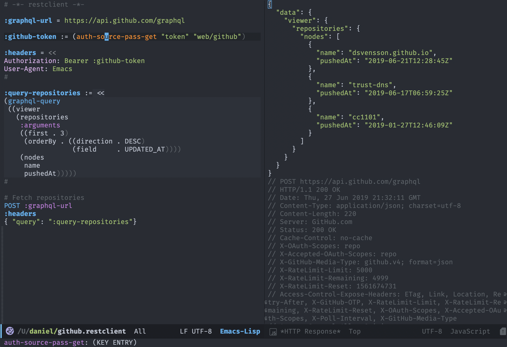

I've been using [`restclient`][1] for quite some time now, but it wasn't until a couple of months ago I got annoyed enough to find its variable and scripting support. To showcase my findings I've put together a small example of accessing the [GitHub GraphQL API][6] using the [`graphql`][4] package. This is only a sample, and for proper GitHub interaction it would be better to use the [`ghub`][5] package.

The most basic assignment using plain `=` operator:
```
:graphql-url = https://api.github.com/graphql
```

Replacing the `=` operator with `:=` evaluates the right hand side as elisp:

```
:github-token := (auth-source-pass-get "token" "web/github")
```

This also showcases accessing extra data in the password store [`pass`][2], via [`auth-password-store`][3]. The content of `web/github` would be something like:

```
$ pass web/github
s1kr1ttp4zzw0rd
token: b0baf377b0baf377b0baf377b0baf377b0baf377
```

Multi-line support via `<<`, and referring to other variables:

```
:headers = <<
Authorization: Bearer :github-token
User-Agent: Emacs
#
```

...and for scripting by combining the `:=` and `<<` operators:

```
:query-repos := <<
(graphql-query
 ((viewer
   (repositories
    :arguments
    ((first . 3)
     (orderBy . ((direction . DESC)
                 (field     . UPDATED_AT))))
    (nodes
     name
     pushedAt)))))
#
```

Finally the actual HTTP call, using the variables now assigned:

```
POST :graphql-url
:headers
{ "query": ":query-repos"}
```

Executing the following via <kbd>C-c</kbd> `+` <kbd>v</kbd> will result in:



As seen by the screenshot, the elisp sections are highlighted correctly. This performed by the [`polymode`][7] package which enables embedding of multiple major modes within the same buffer. While configuring this for `restclient` I found a couple of bugs, and within a day of interacting with the maintainer the issues got resolved - so it seems like a good package to depend on.

The definition for the elisp sections within `restclient` buffers is as follows:

```elisp
(define-hostmode pm/restclient-hostmode
  :mode 'restclient-mode)

(define-innermode pm/restclient-innermode
  :mode 'emacs-lisp-mode
  :head-mode 'host
  :tail-mode 'host)

(define-innermode pm/restclient-single-innermode pm/restclient-innermode
  :head-matcher "^:[^ ]+ :="
  :tail-matcher "\n")

(define-innermode pm/restclient-multi-innermode pm/restclient-innermode
  :head-matcher "^:[^ ]+ := <<\n"
  :tail-matcher "^#\n")

(define-polymode pm/restclient-mode
  :hostmode 'pm/restclient-hostmode
  :innermodes '(pm/restclient-single-innermode
                pm/restclient-multi-innermode))
```

Another useful package is [`company-restclient`][8] which, thanks to [`know-your-http-well`][9], adds completion for pretty much everything that goes into a HTTP header.

[1]: https://github.com/pashky/restclient.el
[2]: https://www.passwordstore.org/
[3]: https://github.com/DamienCassou/auth-password-store
[4]: https://github.com/vermiculus/graphql.el
[5]: https://github.com/magit/ghub
[6]: https://developer.github.com/
[7]: https://github.com/polymode/polymode
[8]: https://github.com/iquiw/company-restclient
[9]: https://github.com/for-GET/know-your-http-well
